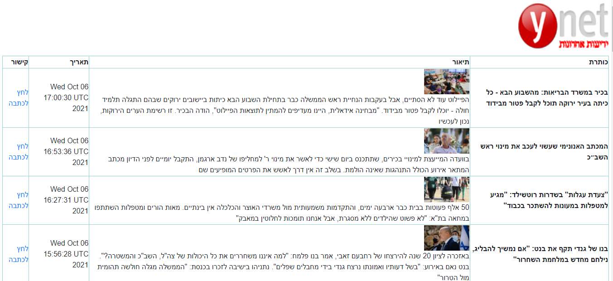

# Jenkins Closing Task

### Requirements: 
Create a Java Application (Managed by Gradle) which reads the “Breaking News” from YNet new service: http://www.ynet.co.il/Integration/StoryRss2.xml
and when connecting to this Web App, the App parses and Presents the Breaking News XML in an HTML Table Format.
_______________________________________________
### Developing the app section :
This is a spring boot web app , managed by gradle.The project consists of 3 classes : 
1. DemoApplication : the main class.
2. AppController 
3. Parser: this calss has the readRSSfeed fucntion ,it reads the RSS Feed from the given URL ,parses the content into html table (As string) and
returns the html table as string by the variable parsedFeed.

The project also has dirctory of resourses which includes the template of the html file (index.html) and the css file (main.css).

Some packages used :  
1. Thymeleaf : is a modern server-side Java template engine for both web and standalone environments.
2. Rometools.rome :ROME is a Java framework for RSS and Atom feeds. ROME includes a set of parsers and generators for the various flavors of syndication feeds, as well as converters to convert from one format to another.

__________________________________________
### Run the app  :
 You can build a jar file and run it from the command line:


```
git clone https://github.com/samahAbbas11/Jenkins_Closing_Task_fursa.git
cd demo/
./gradlew build
java -jar demo/build/libs/demo-0.0.1-SNAPSHOT.jar
```

You can then access the app here: http://localhost:8181/ (OR with any IPv4)




